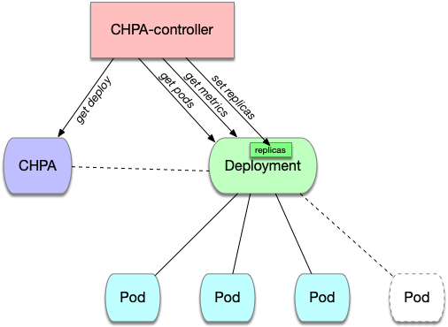

# Now Archived and Forked
_configurable-hpa_ will not be maintained in this repository going forward. Please use, create issues on, and make PRs to the fork of _configurable-hpa_ located [here](https://github.com/gliush/configurable-hpa).


# Configurable HPA

Configurable HPA (CHPA) is a CRD controller that repeats the vanilla HPA v1.11 while providing more configuration parameters.

## Content

  - [Quick Start Guide](#quick-start-guide)
  - [Motivation](#motivation)
  - [CHPA Algorithm](#chpa-algorithm)
  - [CHPA Parameters](#chpa-parameters)
  - [Configuration Examples](#configuration-examples)
  - [Installation](#installation)
  - [Development](#development)
  - [Administration](#administration)
  - [License](#license)

## Usage Guide

Please view the quick start guide [here](QuickStartGuide.md).

## Motivation

The existing vanilla Kubernetes [HPA (Horizontal Pod Autoscaler)](https://kubernetes.io/docs/tasks/run-application/horizontal-pod-autoscale/) in version v1.11 allows one to configure:

- maxReplicas - the upper limit of replicas to which the autoscaler can scale up
- minReplicas - the lower limit of replicas
- metrics - the specification for which to use to calculate the desired replica count

The off the shelf HPA only supports one cluster level configuration parameter that influences how fast the cluster is scaled down:

- [--horizontal-pod-autoscaler-downscale-stabilization-window](https://kubernetes.io/docs/tasks/run-application/horizontal-pod-autoscale/#algorithm-details)   (defaults to 5 min)

And a couple of hard-coded constants that specify how fast the cluster can scale up:

- [scaleUpLimitFactor = 2.0](https://github.com/kubernetes/kubernetes/blob/7ba79c31838632fa535f9aaab516276c2160a09d/pkg/controller/podautoscaler/horizontal.go#L55)
- [scaleUpLimitMinimum = 4.0](https://github.com/kubernetes/kubernetes/blob/7ba79c31838632fa535f9aaab516276c2160a09d/pkg/controller/podautoscaler/horizontal.go#L56)

For more info about how HPA works and what these parameters mean check [the internal sig-autoscaling document](https://docs.google.com/document/d/1Gy90Rbjazq3yYEUL-5cvoVBgxpzcJC9vcfhAkkhMINs/edit#).

There’s no parameter in the vanilla Kubernetes HPA that could be set per HPA to control the scale velocity of one particular cluster, which can be problematic for applications that need to scale faster or slower than others.

So we implemented a [CRD (Custom Resource Definition)](https://kubernetes.io/docs/concepts/extend-kubernetes/api-extension/custom-resources/#customresourcedefinitions)
and a controller that mimics vanilla HPA, and is flexibly configurable.

## CHPA Algorithm



Configurable HPA (CHPA) controller starts every 15 seconds. On every iteration it follows the instruction:

- Check all CHPA objects
- For every CHPA object:
  - Find the correspondent Deployment object
  - Check metrics for all the Containers for all the Pods of the Deployment object
  - Calculate the desired number of Replicas (terms Replicas and Pods mean the same in CHPA context)
  - Adjust Replica Number

## CHPA Parameters

- **UpscaleForbiddenWindowSeconds** - is the duration window from the previous `ScaleUp` event
    for the particular CHPA object when we won't try to ScaleUp again
- **ScaleUpLimitFactor** and **ScaleUpLimitMinimum** limit the number of replicas for the next `ScaleUp` event

    If the Pods metrics show that we should increase the number of replicas,
    the algorithm tries to limit the increase by the `ScaleUpLimit`

    `ScaleUpLimit` is found as a maximum of an absolute number (`ScaleUpLimitMinimum`) and
    of multiplication of `currentReplicas` by a coefficient (`ScaleUpLimitFactor`):

```python
    ScaleUpLimit = max(ScaleUpLimitMinimum, ScaleUpLimitFactor * currentReplicas)
    NextReplicas = min(ScaleUpLimit, DesiredReplicas)
```

- **DownscaleForbiddenWindowSeconds** - the same as `UpscaleForbiddenWindowSeconds`  for `ScaleDown`
- **Tolerance** - how sensitive CHPA to the metrics changes. The default value is `0.1`

    eg., if

    `Math.abs(1 - RealUtilization/TargetUtilization) < Tolerance`

    Then the CHPA won't change the number of replicas.
    Use with care!

## Configuration Examples

`currentReplicas = 1, ScaleUpLimitMinimum = 4, ScaleUpLimitFactor = 2`

- => ScaleUpLimit = 4
- i.e., if metrics show that we should scale up to 10 Replicas, we'll scale up to 4 Replicas
- i.e., if metrics show that we should scale up to 3 Replicas, we'll scale up to 3 Replicas

`currentReplicas = 10, ScaleUpLimitMinimum = 4, ScaleUpLimitFactor = 3`

- => ScaleUpLimit = 30
- i.e., if metrics show that we should scale up to 10 Replicas, we'll scale up to 10 Replicas
- i.e., if metrics show that we should scale up to 40 Replicas, we'll scale up to 30 Replicas

## Installation

Download project and build docker image

```bash
git clone https://github.com/postmates/configurable-hpa.git $GOPATH/src/github.com/postmates/configurable-hpa
docker build -t $IMAGE_NAME:$IMAGE_TAG .
docker push $IMAGE_NAME:$IMAGE_TAG
```

Run the CHPA controller

```bash
helm upgrade configurable-hpa ./deployment/helm/configurable-hpa --install --set image.name=$IMAGE_NAME,image.tag=$IMAGE_TAG
```

## Development

To perform development, you have to store the sources on the following path

    $GOPATH/src/github.com/postmates/configurable-hpa

To run tests, you need to have [kubebuilder](https://book.kubebuilder.io/) installed:

    make test

To run e2e test, you need to have a kubectl in your `$PATH` and have kubectl context configured.

The test creates several Deployments and Services, prepares some load for them and confirms that the Deployment is scaled

    make e2e

WARNING: Do not stop the test, otherwise it won't be able to clean all the test resources automatically.

To manually clean all the resources for the tests:

    kubectl delete service,deploy,chpas.autoscalers.postmates.com -l app=chpa-test

NB: RBAC configs in `config/rbac` are autogenerated and should be used as a draft for your Kubernetes installation.

## Administration

There're two places where you can check problems with your CHPA:

- CHPA object itself. It contains "Events" and "Conditions" that are filled by the CHPA controller. In case of any problem with the CHPA, you should check these fields.

```bash
kubectl describe chpas.autoscalers.postmates.com chpa-example1
```

- CHPA controller logs. The logs may contain information about controller problems, e.g., could not connect to the server.

```bash
stern -n kube-system configurable-hpa
```


**WARNING**: If you want to delete your CHPA, do it carefully not to remove your deployment too. Read the ["Quick Start Guide"](QuickStartGuide.md).

**WARNING**: You should remove the vanilla HPA before starting to use CHPA. If you use both, the behavior is undefined (they'll fight each other).

The skeleton of the controller is created with the help of [Kubebuilder](https://github.com/kubernetes-sigs/kubebuilder).

## License

Configurable-HPA is copyright © 2019 Postmates, Inc and released to the public under the terms of the MIT license.
